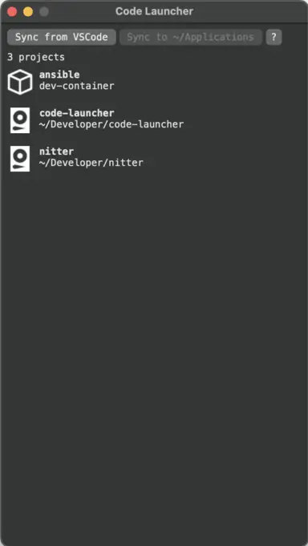

# Code Launcher
Jetbrains Toolbox for VSCode! 

## Screenshots
Windows                    |  macOS
:-------------------------:|:-------------------------:
 | 

## Features
* Lists all your VSCode workspaces
* Opens workspaces with one-click
    * Supports local, WSL, DevContainer and remote SSH workspaces
* Syncs workspaces as shortcuts to various places on the OS so that you can search for and open them conveniently
    * Start menu (Windows)
    * PowerToys Run (Windows)
    * Spotlight (macOS)
    * Alfred (macOS)
    * Raycast (macOS)
    * GNOME Search (Linux)
    * Ulauncher (Linux)
* Supports Windows and macOS
    * Tested on Windows 11
        * Windows 10 should work as well
    * Tested on macOS Sonoma on Apple Silicon
        * Should work as low as macOS Catalina
    * Partial Linux support
        * .deb installation (not flatpak) of VSCode on Ubuntu 24.04 (GNOME) is tested but it should work on other distros/DEs where
            * VSCode binary is installed at `/usr/share/code/code`
            * VSCode config is located at `~/.config/Code`
            * XDG desktop entries in the standard user XDG desktop entries folder `~/.local/share/applications`is supported
        * There is an CLI that can sync VSCode workspaces to `~/.local/share/applications` as desktop entries. There is no GUI yet.
        * The following commands needs to be available: `update-desktop-database` and `notify-send`

## Download
* Windows
    * Download [here](https://nightly.link/sekai-soft/code-launcher/workflows/build/master/windows.zip)
    * The program might be erroneously identified by Windows Security/Defender as Trojan. This is a [known issue by PyInstaller](https://github.com/pyinstaller/pyinstaller/issues/5854) and please exempt `Code Launcher.exe` file.
    * Unzip the downloaded file and run `Code Launcher.exe`
* macOS (Apple Silicon)
    * Download [here](https://nightly.link/sekai-soft/code-launcher/workflows/build/master/mac-arm.zip)
    * Unzip the downloaded file and copy `Code Launcher.app` to your `Applications` folder*
* Linux (CLI)
    * Follow "Initialize development environment" and "Install dependencies" in "Develop app on Linux" section
    * Install a desktop shortcut for the CLI by copying `Reconcile Code Launcher.desktop` to your XDG desktop entries folder
        * Make sure to change `<PATH_TO_CODE_LAUNCHER>` to your actual folder path to the repo
        * Remember to execute `update-desktop-database` (sudo if putting the file in non-user places like `/usr/share/applications`)

## Development

### Initialize development environment
* Make sure Python 3.11 or above is installed
* Initialize virtual environment: `python3 -m venv venv`

### Develop app on Windows
* Install dependencies: `.\venv\Scripts\pip install -r requirements.txt -r requirements_win.txt`
* Run the app: `.\venv\Scripts\python app.py`
* Build the app: `.\venv\Scripts\pyinstaller --clean --noconfirm "Code Launcher.spec"` (the built app can be found in `dist` folder)

### Develop app on macOS
* Install dependencies: `./venv/bin/pip install -r requirements.txt`
* Run the app: `./venv/bin/python app.py`
* Build the app: `./venv/bin/pyinstaller --clean --noconfirm "Code Launcher.spec"` (the built app can be found in `dist` folder)

### Develop app on Linux
* Install dependencies: `./venv/bin/pip install -r requirements.txt`
* Run the CLI: `./venv/bin/python cli.py`
