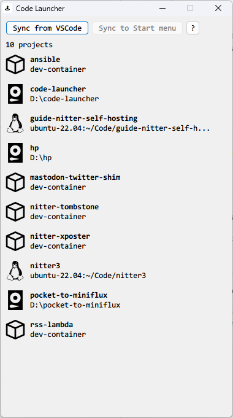

# Code Launcher
Jetbrains Toolbox for VSCode!

## Screenshots



## Features
* Lists all your VSCode workspaces
* Opens workspaces with one-click
    * Supports local, WSL, DevContainer and remote SSH workspaces
* Syncs workspaces as shortcuts to various places on the OS so that you can search for open them conveniently
    * Start menu (Windows)
    * PowerToys Run (Windows)
    * Spotlight (macOS)
    * Alfred (macOS)
    * Raycast (macOS)
* Supports Windows and macOS
    * Tested on Windows 11
        * Windows 10 should work as well
    * Tested on macOS Sonoma on Apple Silicon
        * Should work as low as macOS Catalina

## Download
Find the latest workflow run in [GitHub Actions tab](https://github.com/sekai-soft/code-launcher/actions)

Under the "Artifacts" section
* Windows
    * Download `windows`
    * The program might be erroneously identified by Windows Security/Defender as Trojan. This is a [known issue by PyInstaller](https://github.com/pyinstaller/pyinstaller/issues/5854) and please exempt `Code Launcher.exe` file.
    * Unzip the downloaded file and run `Code Launcher.exe`
* macOS (Apple Silicon)
    * Download `mac-arm`
    * Unzip the downloaded file and copy `Code Launcher.app` to your `Applications` folder

## Development

### Package app on Windows
```
.\venv\Scripts\activate.bat
pyinstaller --name "Code Launcher" --windowed --icon assets\icon.ico --add-data "assets:." --clean --noconfirm .\app.py
```

Then find the built app in `dist` folder

### Package app on macOS
```
source ./venv/bin/activate
pyinstaller --name "Code Launcher" --windowed --icon assets/icon_macos.ico --add-data "assets:." --clean --noconfirm ./app.py
/usr/libexec/PlistBuddy -c "Add :LSUIElement bool true" dist/Code\ Launcher.app/Contents/Info.plist
```

Then find the built app in `dist` folder